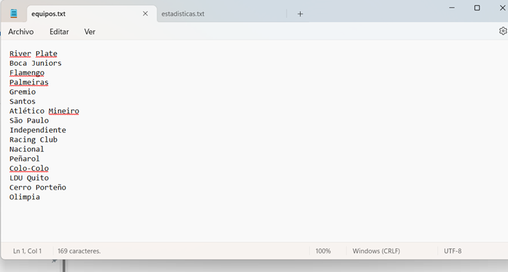
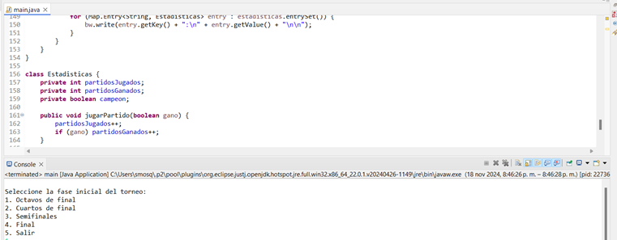
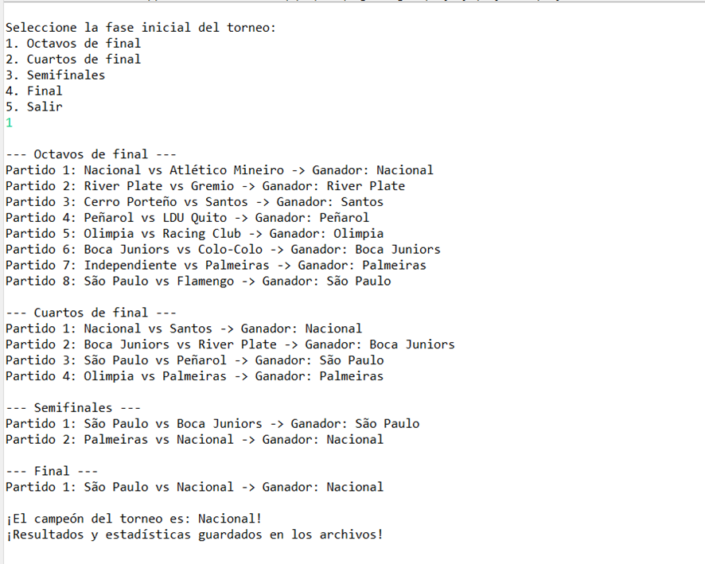
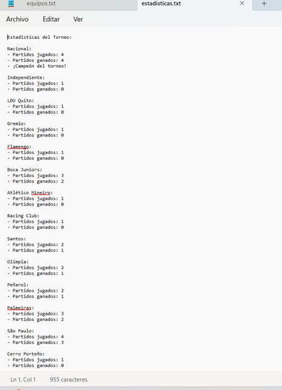
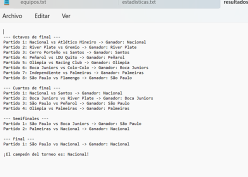

# torneo-futbol
# Desarrollo de la tarea

## Introducción:
 El proyecto consiste en desarrollar una aplicación en Java para organizar y simular un torneo de fútbol profesional compuesto por 16 equipos. Este torneo se basa en un formato de eliminación directa que incluye las fases de octavos de final, cuartos de final, semifinales y final. El sistema debe generar los enfrentamientos de manera aleatoria, garantizar la integridad de los partidos (sin repeticiones en la misma etapa) y registrar los resultados y estadísticas de cada equipo.

## Objetivo del Ejercicio

Diseñar una aplicación que organice partidos de manera aleatoria en cada etapa del torneo.
Asegure reglas básicas como:
- Ningún equipo repite un partido dentro de la misma etapa.
- Un equipo no puede enfrentarse a sí mismo.
- Permita al usuario seleccionar la fase inicial del torneo y simule automáticamente el resto hasta coronar al campeón.
- Genere y registre resultados y estadísticas detalladas de cada equipo, incluyendo información sobre partidos jugados, ganados y el campeón final.

## Propósito del Ejercicio
Este proyecto es una herramienta práctica para aprender y aplicar conceptos fundamentales de programación en Java, como:
- Manipulación de archivos: Leer y escribir datos de equipos, resultados y estadísticas en archivos externos.
- Estructuras de datos: Uso de listas y mapas para manejar equipos, fases del torneo, estadísticas y resultados.
- Manejo de excepciones: Controlar errores en entradas del usuario y durante la lectura/escritura de archivos.
- Interactividad: Permitir que el usuario configure el torneo seleccionando la fase inicial.
- Automatización: Progresar automáticamente a través de las fases del torneo, generando emparejamientos y seleccionando ganadores.

## Funcionalidades
1.	Los equipos participantes se cargan desde un archivo externo verificando que haya un número suficiente de equipos para el torneo

2.En el menú el usuario puede elegir en qué fase desea iniciar el torneo como: Octavos de final, Cuartos de final, Semifinales, Final, Salir del torneo. A partir de la fase seleccionada, el programa simula automáticamente el resto del torneo hasta coronar al campeón.

3.	Los partidos se generan mediante emparejamientos aleatorios entre los equipos disponibles, el ganador de cada partido se decide de forma aleatoria y los resultados de cada partido se imprimen en pantalla y se registran en un archivo de resultados (resultados.txt).

4. Cada equipo tiene estadísticas detalladas que incluyen: Partidos jugados. Partidos ganados, indicación de si fue campeón o no, estas estadísticas se guardan en un archivo independiente 
(estadisticas.txt). 

5.	En la Salida de datos al final del torneo, se genera un archivo completo con todos los resultados del torneo, incluyendo las fases jugadas y los partidos disputados y un archivo adicional contiene las estadísticas completas de todos los equipos participantes.

## Conclusión: 
Este programa es una solución efectiva para torneos. Es fácil de usar, ya que una vez que el usuario ingresa los equipos y la etapa inicial, el programa se encarga de todo lo demás, desde los emparejamientos de equipos hasta las etapas de eliminación llegando a la selección de ganadores. La estructura es clara y permite ver cómo los equipos avanzan hasta llegar al campeón.
